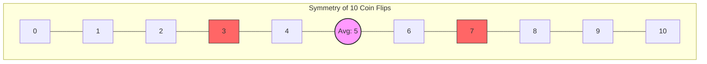
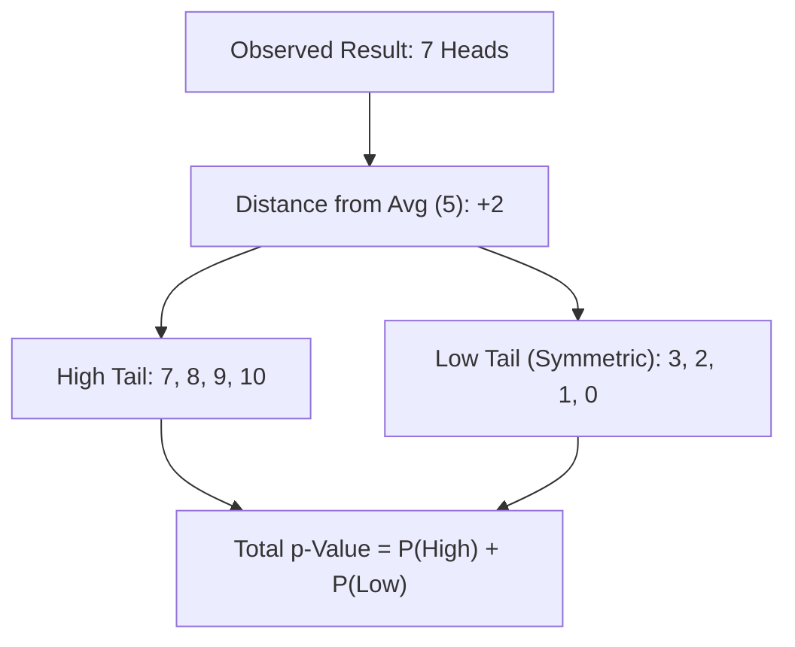

```js
import { runGridSim, runCoinSim, runShuffleSim } from "./understanding-the-p-value/js/coin-simulations.js";
import { combinations, binomialPMF, findCriticalValue, calculatePValue } from "./understanding-the-p-value/js/p-value-utils.js";
```

# Understanding the ${tex`p`}-Value

**Why do we care about ${tex`p`}-values?**

In science, medicine, and critical thinking, we often need to decide if an observation is "real" or just a random fluke. For example:
*   Does a new drug *actually* cure a disease, or did patients get better on their own?
*   Is a coin *actually* rigged, or did we just get lucky with 10 Heads in a row?
*   Is a global temperature rise *actually* significant, or is it normal fluctuation?

The **${tex`p`}-value** is the standard tool we use to quantify this uncertainty.
It helps us draw the line between "random noise" and "statistically significant discovery."

Let's explore the concept from first principles using the following experiment: **tossing a coin**.

## The Experiment

Imagine we have a coin with two sides: **Heads** and **Tails**. 
If it is fair, each side has an equal probability of appearing 

> ${tex`\Pr(\text{Heads}) = \Pr(\text{Tails}) = \frac{\text{Number of favorable outcomes}}{\text{Number of possible outcomes}} = \frac{1}{2} = 0.5`}

### "Dropping Coins" Simulation

We replace tossing a coin ${tex`n`} times with a computer simulation of dropping ${tex`n`} coins.

```js
const rollsInput = Inputs.range([10, 1000], {value: 100, step: 10, label: "Number of Tosses (n)"});
const rolls = Generators.input(rollsInput);
view(rollsInput);
```

```js
// Simulate the tosses (0 = Tails, 1 = Heads)
const data = Array.from({length: rolls}, () => Math.random() < 0.5 ? "Heads" : "Tails");

// Count occurrences
const counts = d3.rollup(data, v => v.length, d => d);
const flatCounts = Array.from(counts, ([face, count]) => ({face, count}));
```

```js
const container = html`<div style="width: 100%; height: 300px; background: var(--theme-background-alt); border-radius: 8px; overflow: hidden; position: relative;"></div>`;
display(container);
runGridSim(container, data, invalidation);
```

Here are the results of our simulation:

```js
Plot.plot({
y: {
  grid: true, 
  label: "Count"},
x: {
  domain: ["Heads", "Tails"],
  label: "Outcome"},
marks: [
  Plot.barY(flatCounts, {x: "face", y: "count", fill: "steelblue"}),
  Plot.ruleY([rolls / 2], {stroke: "red", strokeDasharray: "4", strokeWidth: 2, title: "Expected (Fair)"})]})
```

### Expected Count

The red line shows the expected count for a perfectly fair coin: 

> ${tex`n \cdot \Pr(\text{Heads}) = n \cdot \frac{1}{2} = \frac{n}{2}`}

As you increase ${tex`n`}, the actual counts should cluster more closely around this line relative to the total size.

## Is the Coin Rigged?

Let's assume we have three coins, A, B, and C.

### "Coin A" Simulation

```js
const coinA_input = Inputs.range([1, 100], {value: 10, step: 1, label: "Tosses (Coin A)"});
const coinA_n = Generators.input(coinA_input);
view(coinA_input);
```

```js
const dataA = Array.from({length: coinA_n}, () => Math.random() < 0.2 ? "Heads" : "Tails"); // Rigged Tails
const containerA = html`<div style="width: 100%; height: 250px; background: var(--theme-background-alt); border-radius: 8px; overflow: hidden;"></div>`;
display(containerA);
runCoinSim(containerA, dataA, invalidation);
```

Here is the summary of the simulation:

```js
const headsA = dataA.filter(d => d === "Heads").length;
const tailsA = dataA.filter(d => d === "Tails").length;
const flatCountsA = [{face: "Heads", count: headsA}, {face: "Tails", count: tailsA}];

display(Plot.plot({
  y: {grid: true, label: "Count"},
  x: {domain: ["Heads", "Tails"], label: "Outcome"},
  marks: [
    Plot.barY(flatCountsA, {x: "face", y: "count", fill: "steelblue"}),
    Plot.ruleY([coinA_n / 2], {stroke: "red", strokeDasharray: "4", strokeWidth: 2, title: "Expected (Fair)"})
  ]
}));
```

### "Coin B" Simulation

```js
const coinB_input = Inputs.range([1, 100], {value: 10, step: 1, label: "Tosses (Coin B)"});
const coinB_n = Generators.input(coinB_input);
view(coinB_input);
```

```js
const dataB = Array.from({length: coinB_n}, () => Math.random() < 0.5 ? "Heads" : "Tails"); // Fair
const containerB = html`<div style="width: 100%; height: 250px; background: var(--theme-background-alt); border-radius: 8px; overflow: hidden;"></div>`;
display(containerB);
runCoinSim(containerB, dataB, invalidation);
```

Here is the summary of the simulation:

```js
const headsB = dataB.filter(d => d === "Heads").length;
const tailsB = dataB.filter(d => d === "Tails").length;
const flatCountsB = [{face: "Heads", count: headsB}, {face: "Tails", count: tailsB}];

display(Plot.plot({
  y: {grid: true, label: "Count"},
  x: {domain: ["Heads", "Tails"], label: "Outcome"},
  marks: [
    Plot.barY(flatCountsB, {x: "face", y: "count", fill: "steelblue"}),
    Plot.ruleY([coinB_n / 2], {stroke: "red", strokeDasharray: "4", strokeWidth: 2, title: "Expected (Fair)"})
  ]
}));
```

### "Coin C" Simulation

```js
const coinC_input = Inputs.range([1, 100], {value: 10, step: 1, label: "Tosses (Coin C)"});
const coinC_n = Generators.input(coinC_input);
view(coinC_input);
```

```js
const dataC = Array.from({length: coinC_n}, () => Math.random() < 0.8 ? "Heads" : "Tails"); // Rigged Heads
const containerC = html`<div style="width: 100%; height: 250px; background: var(--theme-background-alt); border-radius: 8px; overflow: hidden;"></div>`;
display(containerC);
runCoinSim(containerC, dataC, invalidation);
```

Here is the summary of the simulation:

```js
const headsC = dataC.filter(d => d === "Heads").length;
const tailsC = dataC.filter(d => d === "Tails").length;
const flatCountsC = [{face: "Heads", count: headsC}, {face: "Tails", count: tailsC}];

display(Plot.plot({
  y: {grid: true, label: "Count"},
  x: {domain: ["Heads", "Tails"], label: "Outcome"},
  marks: [
    Plot.barY(flatCountsC, {x: "face", y: "count", fill: "steelblue"}),
    Plot.ruleY([coinC_n / 2], {stroke: "red", strokeDasharray: "4", strokeWidth: 2, title: "Expected (Fair)"})
  ]
}));
```

### Which Coin is Rigged?

If you would guess which coin is rigged, which one would it be?

Now, suppose we suspect the coin is **rigged**.
This is where we could talk about two possible biases:

1.  **Heads Bias:** The coin is rigged to show **Heads** more often than it should.
2.  **Tails Bias:** The coin is rigged to show **Tails** more often than it should.

So we could ask ourselves:

1. Is the coin rigged towards only one direction? (one-sided bias)
2. Is the coin rigged towards any of the directions? (two-sided bias)

We will be testing the two-sided bias.
We will assume we don't know the direction of the bias, but want to test in both directions.

How many times do we need to see, for example, "Heads" in ${tex`n`} tosses to be confident it's not just chance?

This is where the **${tex`p`}-Value** comes in.
The ${tex`p`}-Value gives us the probability of seeing a result as extreme as (or more extreme than) what we observed, assuming the coin is fair.
This assumption is called the **Null Hypothesis**, denoted as ${tex`H_0`}.

If this ${tex`p`}-Value is **very low**... but wait, what does **very low** mean? 
That's where we need to introduce the **Significance Level**, denoted as ${tex`\alpha`}.
Let's say ${tex`\alpha`} is ${tex`0.05`} or ${tex`5`}%.
If the ${tex`p`}-Value is less than ${tex`\alpha`}, we reject the ${tex`H_0`} with a confidence of ${tex`1 - \alpha`}, and conclude the coin is **likely rigged**.

### Tipping Point Calculator

Enter your criteria below to find the **tipping point**.

1.  **Significance Level (${tex`\alpha`}):** The probability threshold for rejecting the **Null Hypothesis** when it's actually true (false positive rate).
2.  **Number of Rolls (N):** The total tosses.

```js
const form = Inputs.form({
  confidence: Inputs.range([50, 99.9], {value: 95, step: 0.1, label: "Confidence Level (%)"}),
  n: Inputs.number([1, 10000], {value: 10, label: "Tosses (n)"})
});
const values = Generators.input(form);
view(form);
```

```js
const confidence = values.confidence;
const alpha = (100 - confidence) / 100;
const nCheck = values.n;
const pFair = 0.5;

const criticalValue = findCriticalValue(nCheck, pFair, alpha);
```

### Result

```js
display(html`
<div class="card" style="padding: 20px; border-left: 5px solid var(--theme-foreground-muted, #ccc); display: flex; flex-direction: column; gap: 10px;">
<h3 style="margin: 0; color: var(--theme-foreground-focus);">Verdict</h3>

<p style="margin: 0;">
For <b>${nCheck}</b> tosses, assuming a fair coin:
</p>
<p style="margin: 0;">
If you see <b>Heads</b> appear <strong>${criticalValue}</strong> times or more,
</p>
<p style="margin: 0;">
We can say it is <b>rigged</b> at the <strong>${confidence}%</strong> confidence level.
</p>
<div style="margin-top: 10px; padding-top: 10px; border-top: 1px solid var(--theme-foreground-faintest); font-size: 0.8em; color: var(--theme-foreground-muted);">
Expected count for fair coin: ${(nCheck/2).toFixed(1)} <br/>
(p-value threshold: < ${alpha.toFixed(3)})
</div>
</div>
`);
```

This means if you count the occurrences of Heads, and the count is less than ${criticalValue}, you cannot statistically claim it's rigged at the ${confidence}% confidence level.
You fail to reject the **Null Hypothesis**.

### Quick ${tex`p`}-Value Calculator

Here is the other way around, where we want to calculate the ${tex`p`}-value given a number of tosses and a number of Heads.

```js
const quickForm = Inputs.form({
  nQuick: Inputs.number([1, 10000], {value: 10, label: "Total Tosses (n)"}),
  kQuick: Inputs.number([0, 10000], {value: 7, label: "Observed Heads (k)"})
});
const quickValues = Generators.input(quickForm);
view(quickForm);
```

```js
const n2 = quickValues.nQuick;
const k2 = quickValues.kQuick;

const pValueResult = calculatePValue(n2, k2);
```

### ${tex`p`}-Value Result

```js
display(html`
<div class="card" style="padding: 20px; border-left: 5px solid var(--theme-foreground-muted, #ccc); display: flex; flex-direction: column; gap: 10px;">
<h3 style="margin: 0; color: var(--theme-foreground-focus);">${tex`p`}-Value Result</h3>

<p style="margin: 0;">
For <b>${k2}</b> heads in <b>${n2}</b> tosses:
</p>
<p style="margin: 0; font-size: 1.5em;">
${tex`p`}-value = <strong>${pValueResult.toFixed(4)}</strong>
</p>
<p style="margin: 0;">
Verdict: <b>${pValueResult < 0.05 ? "Statistically Significant" : "Not Significant"}</b> (at ${tex`\alpha = 0.05`})
</p>
</div>
`);
```

## The Math Behind the Calculators

To understand how the **tipping point** or ${tex`p`}-value is calculated, let's consider **only** the following example:

> Out of ${tex`10`} coin flips, we got ${tex`7`} **Heads**.

Then we ask ourselves:

> If the coin is fair (no bias towards any of the sides), what is the probability of it landing on that many **Heads** in ${tex`10`} tosses?

For landing on Heads, remember the probability formula: 

> ${tex`\Pr(\text{Heads}) = \frac{\text{Number of favorable outcomes}}{\text{Total number of possible outcomes}} = \frac{1}{2}`}

To find the ${tex`p`}-value, we don't just look at the probability of the result we got, i.e. ${tex`7`} **Heads**. 
We have to look at how likely it is to get a result at least as **extreme** as the one we observed.

If **extreme** means straying far away from the expected average (the average would be ${tex`10 \cdot \frac{1}{2} = 5`} **Heads**), then:

> Which other outcomes would be considered more extreme than getting ${tex`7`} **Heads**?

To calculate the ${tex`p`}-value, (but note that this is a two-sided test) we need the probability of the result we got (${tex`7`}) plus the probability of anything more extreme.

So, on the _high side_ (lots of Heads), we care about the probability of getting ${tex`7`}, ${tex`8`}, ${tex`9`}, or ${tex`10`} **Heads**.

But we also have to consider the _low side_. 
If the coin were rigged to favor **Tails**, we would see very few **Heads**.

> If ${tex`7`} Heads is "${tex`2`} steps" away from the average of ${tex`5`}, what number of Heads would be "${tex`2`} steps" away on the lower side?

Since the average is ${tex`5`}, getting ${tex`3`} **Heads** is just as "extreme" (${tex`2`} steps away) as getting ${tex`7`} **Heads**, just in the opposite direction.



This is why we call it a two-sided/two-tailed test: we care about extremes on both ends because the coin could be rigged to favor **Heads** **OR** **Tails**.



To find the ${tex`p`}-value, we need to add up the probabilities of all these extreme outcomes:

1. High side: ${tex`7`}, ${tex`8`}, ${tex`9`}, ${tex`10`} **Heads**
2. Low side: ${tex`3`}, ${tex`2`}, ${tex`1`}, ${tex`0`} **Heads**

Because the fair coin (${tex`\Pr(\text{Heads})=\Pr(\text{Tails})=0.5`}) is symmetric, the probability of the _high side_ is identical to the probability of the low side.
We can just calculate the probability for the _high side_ (${tex`7`}, ${tex`8`}, ${tex`9`}, ${tex`10`}) and double it.

> How to calculate the probability of getting exactly ${tex`7`} Heads in ${tex`10`} tosses?

First, we consider the probability of getting exactly ${tex`7`} Heads in ${tex`10`} tosses:

> ${tex`\Pr(\text{7 Heads}) = ?`}

We're missing two pieces.

> ${tex`\Pr(\text{7 Heads}) = \square \cdot \square`}

The first piece is the probability of getting ${tex`7`} Heads in ${tex`10`} tosses.
We tossed the coin ${tex`10`} times, so if we got ${tex`7`} Heads, we effectively also got ${tex`3`} Tails.
We need to multiply by the probability of those tails (0.5^3).
> ${tex`0.5^7 \times 0.5^3 = 0.5^{10}`}

This is the probability of *one specific sequence* (e.g., `H H H H H H H T T T`).

The formula looks like:

> ${tex`\Pr(\text{7 Heads}) = \square \cdot 0.5^{10}`}

The second piece is the number of ways to arrange ${tex`7`} Heads in ${tex`10`} tosses.

The **Heads** don't have to appear first. They could be mixed in (e.g., `H T H T H H H H T H`). 

Let's consider this simulation, where we can see the different ways to arrange ${tex`7`} **Heads** and ${tex`3`} **Tails**.

Use the inputs to change the number of **Heads** and **Tails** and the number of shuffles.

```js
const shuffleForm = Inputs.form({
  heads: Inputs.range(
    [1, 15], 
    {
      value: 7, 
      step: 1, 
      label: "Heads Count"
    }),
  tails: Inputs.range(
    [1, 15], 
    {
      value: 3, 
      step: 1, 
      label: "Tails Count"
    }),
  shuffles: Inputs.range(
    [1, 20], 
    {
      value: 5, 
      step: 1, 
      label: "Shuffles"
    })
});
const shuffleValues = Generators.input(shuffleForm);
view(shuffleForm);
```

```js
const {heads, tails, shuffles} = shuffleValues;
const container = display(html`<div style="height: 180px; width: 100%; position: relative; overflow: hidden; background: var(--theme-background-alt); border: 1px solid var(--theme-foreground-faintest); border-radius: 8px;"></div>`);
runShuffleSim(container, heads, tails, shuffles, width);
```

Back to the math.

> We need to count how many different "shuffles" or ways there are to get ${tex`7`} **Heads** out of ${tex`10`}.

Since we have ${tex`10`} tosses and want to choose which ${tex`7`} of them are **Heads** (and the rest will be **Tails**), we need to calculate the unique arrangements of coins.
This is called a combination: it's an arrangement where the order doesn't matter. 
The formula is called the "binomial coefficient" (for some historical reasons we won't go into here).
It is also known as combinations or choices: 

> ${tex`C_n^k=\binom{n}{k} = \frac{n!}{k!(n-k)!}`}

We read it as "how many ways can we choose ${tex`k`} objects out of ${tex`n`}" objects.

So the final formula is:

> ${tex`\Pr(\text{7 Heads}) = \binom{10}{7} \times \left(\frac{1}{2}\right)^{10}`}

Then we want to consider the other extreme cases:

1. 8 Heads and 2 Tails, i.e. ${tex`\Pr(\text{8 Heads})`}
2. 9 Heads and 1 Tail, i.e. ${tex`\Pr(\text{9 Heads})`}
3. 10 Heads and 0 Tails, i.e. ${tex`\Pr(\text{10 Heads})`}

We observe that the second part of the formula is the same for all cases: 

> ${tex`{0.5}^{8} \cdot {0.5}^{2} = {0.5}^{9} \cdot {0.5}^{1} = {0.5}^{10} \cdot {0.5}^{0} = {0.5}^{10}`}

> ${tex`\Pr(\text{8 Heads}) = \square \times {0.5}^{10}`}

> ${tex`\Pr(\text{9 Heads}) = \square \times {0.5}^{10}`}

> ${tex`\Pr(\text{10 Heads}) = \square \times {0.5}^{10}`}

The first part of the formula is different:

1. the number of combinations of ${tex`8`} out of ${tex`10`}, ${tex`\binom{10}{8} = 45`}
2. the number of combinations of ${tex`9`} out of ${tex`10`}, ${tex`\binom{10}{9} = 10`}
3. the number of combinations of ${tex`10`} out of ${tex`10`}, ${tex`\binom{10}{10} = 1`}

So let's sum up all the ways to get a result **at least as extreme as ${tex`7`} Heads** on the _high side_:

> ${tex`\Pr(\text{at least 7 Heads}) = \\ \Pr(\text{7 Heads}) + \Pr(\text{8 Heads}) + \Pr(\text{9 Heads}) + \Pr(\text{10 Heads})`} 

> ${tex`= \binom{10}{7} \times (0.5)^{10} + \binom{10}{8} \times (0.5)^{10} + \binom{10}{9} \times (0.5)^{10} + \binom{10}{10} \times (0.5)^{10}`}

> ${tex`= (120 + 45 + 10 + 1) \times (0.5)^{10} = 176 \times (0.5)^{10}`}

> ${tex`\Pr(\text{at least 7 Heads}) = 176 \times (0.5)^{10}`}

Since it is a symmetric two-tailed test, the ways for the _low side_ are the same. 

> ${tex`\Pr(\text{at most 3 Heads}) = \Pr(\text{at least 7 Heads})`}

> ${tex`\Pr(\text{at most 3 Heads}) + \Pr(\text{at least 7 Heads}) = 2 \times 176 \times (0.5)^{10} = 0.34375`}

This is the two-tailed ${tex`p`}-value.

It is ${tex`34.4\%`}, which is bigger than ${tex`5\%`}, so we fail to reject ${tex`H_0`}.

Here is what that number tells us: 
If you had a perfectly fair coin and repeated this ${tex`10`}-toss experiment many times,
you would see a result this extreme (or more extreme) about **${tex`34.4`}% of the time** just by pure luck.

In statistics, we need a standard to decide if an event is "rare enough" to reject our assumption that the coin is fair.
This standard is called the **Significance Level** (symbol: ${tex`\alpha`}), and it is commonly set at **${tex`0.05`}** (${tex`5`}%).

* If the ${tex`p`}-value is **less than  ${tex`\alpha`}**, the event is so rare that we reject the **Null Hypothesis** (we say the coin is rigged).
* If the ${tex`p`}-value is **greater than ${tex`\alpha`}**, the event could easily happen by chance, so we keep the **Null Hypothesis** (we assume the coin is fair).

### The one-tailed ${tex`p`}-value

The one-tailed ${tex`p`}-value is the probability of getting a result as extreme as or more extreme than the observed result, in one direction only.

We assume the coin is rigged towards **Heads**.

> ${tex`\Pr(\text{at least 7 Heads}) = 176 \times (0.5)^{10} = 0.0176`}

### Generic Formula for Two-Tailed ${tex`p`}-Value

Assuming we observed more heads than average (so ${tex`k > \frac{n}{2}`}), the formula for the two-tailed ${tex`p`}-value is:

```tex
{p}\text{-value} = 2 \times \sum_{i=k}^{n} \binom{n}{i} 0.5^n
```

This literally translates to: 

> Calculate the probability for ${tex`i`} heads, where ${tex`i`} starts at your result ${tex`k`} and goes up to ${tex`n`}. Add them all up. Then double it.

### Another Approach for Doing the Math

As some of you have noticed, the problem can also be reduced to:

> ${tex`\Pr(\text{at least 7 Heads}) = \frac{\text{number of ways to get at least 7 Heads}}{\text{total number of possible outcomes}}`}

The **number of ways to get at least 7 Heads** are the sum of the combinations of ${tex`7`}, ${tex`8`}, ${tex`9`}, and ${tex`10`}, i.e. ${tex`\binom{10}{7} + \binom{10}{8} + \binom{10}{9} + \binom{10}{10}`}.

The **total number of possible outcomes** for ${tex`10`} relies on counting how many strings of this types there are:

> `HHHHHHHHHH`
>
> `HHHHHHHHHT`
>
> `HHHHHHHHTT`
>
> ...
>
> `TTTTTTTTTT`

This is the same as binary numbers from ${tex`0`} to ${tex`1023`}.
If we replace `H` with `0` and `T` with `1`:

> `0000000000`
>
> `0000000001`
>
> `0000000010`
>
> ...
>
> `1111111111`

This is the same as ${tex`2^{10}`}, i.e. ${tex`1024`}. 

Therefore we have all the variables for the formula:

1. **Outcomes as extreme as ours (or more):** ${tex`352`} (we calculated this by adding up the ways for both tails).
2. **Total possible outcomes:** ${tex`1024`}

To find the **${tex`p`}-value**, we just divide the number of specific outcomes by the total number of possible outcomes.

> ${tex`\Pr(\text{at least 7 Heads}) = \frac{\text{number of ways to get at least 7 Heads}}{\text{total number of possible outcomes}}`}

> ${tex`\Pr(\text{at least 7 Heads}) = \frac{176}{1024} \approx 0.1719`}

Then for the other tail:

> ${tex`\Pr(\text{at most 3 Heads}) = \Pr(\text{at least 7 Heads}) = \frac{176}{1024} \approx 0.1719`}

And in the end we add them up:

> ${tex`\Pr(\text{at most 3 Heads}) + \Pr(\text{at least 7 Heads}) = \frac{176}{1024} + \frac{176}{1024} = \frac{352}{1024} \approx 0.3438`}

## Simulating the Coin Toss Experiment in Different Programming Languages

### R

`R` is a statistical programming language that is great for statistics and data analysis.

The code:
```r
n <- 10
k <- 8
binom.test(k,n,p=0.5,alternative='two.sided')
```

In a Docker friendly one liner:

```powershell
docker run --rm r-base Rscript -e "n<-10; k<-8; res<-binom.test(k,n,p=0.5,alternative='two.sided'); cat(sprintf('n=%d k=%d p-value=%g\n',n,k,res`$p.value))"
```

### Julia

`Julia` is a high-level, high-performance dynamic programming language for technical computing.

```julia
import Pkg
Pkg.activate(; temp=true)
Pkg.add("HypothesisTests")

using HypothesisTests
pvalue(BinomialTest(8, 10, 0.5))
```

In a Docker friendly one liner:

```powershell
docker run --rm julia:1.9.3 julia -e 'import Pkg; Pkg.activate(; temp=true); Pkg.add(\"HypothesisTests\"); using HypothesisTests; println(pvalue(BinomialTest(8, 10, 0.5)))'
```

### Python

```python
from scipy.stats import binom

n = 10
k = 8
p = 0.5

p_value = binom.sf(k, n, p) * 2
print(p_value)
```

In a Docker friendly one liner:

```powershell
docker run --rm python:3.12-alpine python -c "from scipy.stats import binom; n=10; k=8; p=0.5; p_value=binom.sf(k, n, p) * 2; print(p_value)"
```

## Further Reading

### Binomial Tests

Binomial tests are a type of statistical test that is used to determine if there is a significant difference between the expected and observed number of successes in a sample.

Why is it called "binomial"? Because it is based on the binomial distribution, which is a probability distribution that models the number of successes in a fixed number of independent Bernoulli trials.

References:

1. [Wikipedia: Binomial Test](https://en.wikipedia.org/wiki/Binomial_test)
2. [Wikipedia: Binomial Distribution](https://en.wikipedia.org/wiki/Binomial_distribution)

### Two-tailed vs One-tailed Tests

In the coin toss example, we used a two-tailed test because we were interested in both extreme events (high tails and low tails), corresponding to the coin either being rigged for Heads or Tails.

If we want to limit the test to one tail, we need to decide which tail we are interested in. 

If testing heads bias (${tex`Pr(H|H_0)>0.5`}):
> ${tex`P(K\geq k\mid H_0)`}

If testing tails bias (${tex`Pr(T|H_0)<0.5`}):
> ${tex`P(K\leq k\mid H_0)`}

If we want to write the formula in a more general sense, without assuming the two-tailed test, we can use the following formula:

Under ${tex`H_0`}, the number of heads ${tex`K`} follows a binomial distribution:
> ${tex`K\sim \mathrm{Binomial}(n,0.5)`}

The ${tex`p`}-value is:

> ${tex`P(|K-n/2|\geq |k-n/2|\mid H_0)`}
