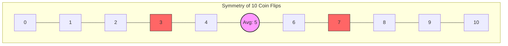
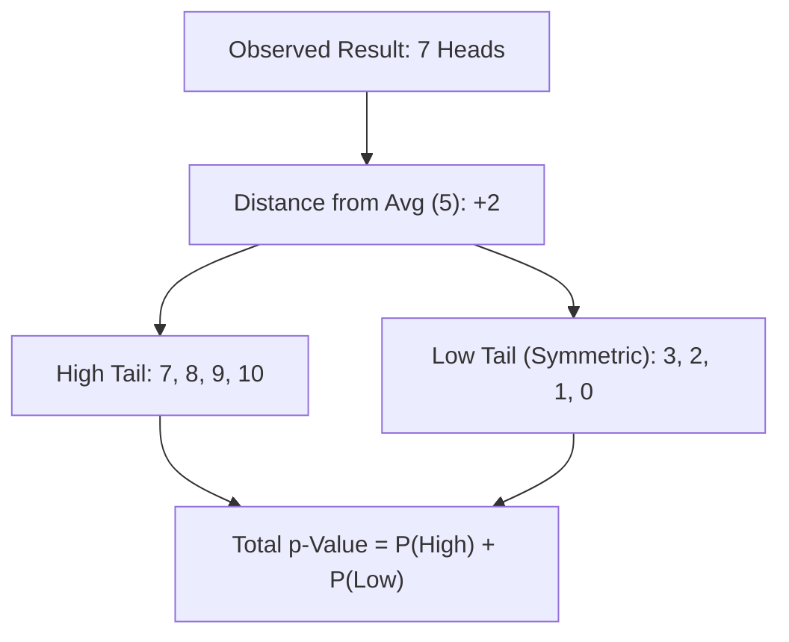

# Understanding the ${tex`p`}-Value

**Why do we care about ${tex`p`}-values?**

In science, medicine, and critical thinking, we often need to decide if an observation is "real" or just a random fluke. For example:
*   Does a new drug *actually* cure a disease, or did patients get better on their own?
*   Is a coin *actually* rigged, or did we just get lucky with 10 Heads in a row?
*   Is a global temperature rise *actually* significant, or is it normal fluctuation?

The **${tex`p`}-value** is the standard tool we use to quantify this uncertainty.
It helps us draw the line between "random noise" and "statistically significant discovery."

Let's explore the concept from first principles using the following experiment: **tossing a coin**.

## The Experiment

Imagine we have a coin with two sides: **Heads** and **Tails**. 
If it is fair, each side has an equal probability of appearing 

> ${tex`\Pr(\text{Heads}) = \Pr(\text{Tails}) = \frac{\text{Number of favorable outcomes}}{\text{Number of possible outcomes}} = \frac{1}{2} = 0.5`}

We can simulate tossing this coin ${tex`n`} times.

```js
const rollsInput = Inputs.range([10, 1000], {value: 100, step: 10, label: "Number of Tosses (n)"});
const rolls = Generators.input(rollsInput);
view(rollsInput);
```

```js
// Simulate the tosses (0 = Tails, 1 = Heads)
const data = Array.from({length: rolls}, () => Math.random() < 0.5 ? "Heads" : "Tails");

// Count occurrences
const counts = d3.rollup(data, v => v.length, d => d);
const flatCounts = Array.from(counts, ([face, count]) => ({face, count}));
```

A small simulation of tossing ${tex`n`} coins.

```js
const THREE = await import("https://esm.sh/three@0.160.0");

const container = html`<div style="width: 100%; height: 300px; background: var(--theme-background-alt); border-radius: 8px; overflow: hidden; position: relative;"></div>`;
display(container);

const width = container.clientWidth || 640;
const height = 300;

const scene = new THREE.Scene();
const camera = new THREE.PerspectiveCamera(75, width / height, 0.1, 1000);
const renderer = new THREE.WebGLRenderer({ antialias: true, alpha: true });
renderer.setSize(width, height);
renderer.setPixelRatio(window.devicePixelRatio);
container.appendChild(renderer.domElement);

const ambientLight = new THREE.AmbientLight(0xffffff, 0.5);
scene.add(ambientLight);
const directionalLight = new THREE.DirectionalLight(0xffffff, 1);
directionalLight.position.set(5, 10, 7.5);
scene.add(directionalLight);

// Adaptive camera position based on number of tosses
const colsAdjust = Math.ceil(Math.sqrt(rolls));
const adaptiveZ = Math.max(15, colsAdjust * 2.5);
camera.position.z = adaptiveZ;
camera.position.y = adaptiveZ * 0.7;
camera.lookAt(0, 0, 0);

const goldColor = "#ffd700";
const silverColor = "#888888";
const coinGeometry = new THREE.CylinderGeometry(1, 1, 0.2, 32);

function createCoinFace(text, bgColor, textColor) {
  const canvas = document.createElement("canvas");
  canvas.width = 128;
  canvas.height = 128;
  const ctx = canvas.getContext("2d");
  ctx.fillStyle = bgColor;
  ctx.fillRect(0, 0, 128, 128);
  ctx.fillStyle = textColor;
  ctx.font = "bold 80px sans-serif";
  ctx.textAlign = "center";
  ctx.textBaseline = "middle";
  ctx.fillText(text, 64, 64);
  const texture = new THREE.CanvasTexture(canvas);
  texture.colorSpace = THREE.SRGBColorSpace;
  return texture;
}

const headsTexture = createCoinFace("H", goldColor, silverColor);
const tailsTexture = createCoinFace("T", silverColor, goldColor);

const goldMaterial = new THREE.MeshStandardMaterial({
  map: headsTexture,
  metalness: 0.7,
  roughness: 0.3
});
const silverMaterial = new THREE.MeshStandardMaterial({
  map: tailsTexture,
  metalness: 0.6,
  roughness: 0.4
});
const edgeMaterial = new THREE.MeshStandardMaterial({
  color: 0xb0b0b0,
  metalness: 0.8,
  roughness: 0.2
});

const coinMaterials = [edgeMaterial, goldMaterial, silverMaterial];


const coins = [];
const maxAnimate = rolls; // Animate all coins as requested

// Grid parameters for non-overlapping landing spots
const spacing = 2.5;

const cols = Math.ceil(Math.sqrt(maxAnimate));
const offset = ((cols - 1) * spacing) / 2;

for (let i = 0; i < maxAnimate; i++) {
  const isHeads = data[i] === "Heads";
  const coin = new THREE.Mesh(coinGeometry, coinMaterials);
  
  // Grid position (row, col) with jitter
  const gridX = (i % cols) * spacing - offset;
  const gridZ = Math.floor(i / cols) * spacing - offset;
  const jitterX = (Math.random() - 0.5) * 1;
  const jitterZ = (Math.random() - 0.5) * 1;
  
  const targetX = gridX + jitterX;
  const targetZ = gridZ + jitterZ;

  // Start positions (high above target)
  coin.position.set(targetX, 15 + Math.random() * 20, targetZ);

  coin.rotation.set(
    Math.random() * Math.PI,
    Math.random() * Math.PI,
    Math.random() * Math.PI
  );

  const velocity = -0.1 - Math.random() * 0.1;
  const rotationSpeed = {
    x: (Math.random() - 0.5) * 0.2,
    y: (Math.random() - 0.5) * 0.2,
    z: (Math.random() - 0.5) * 0.2
  };
  
  scene.add(coin);
  coins.push({
    mesh: coin,
    vel: velocity,
    rot: rotationSpeed,
    landingY: 0.1, // Half of cylinder height (0.2)
    landed: false,
    targetRotX: isHeads ? 0 : Math.PI,
    targetRotZ: 0 // Keep H/T upright
  });
}

let frame = 0;
function animate() {
  frame++;
  let allLanded = true;
  coins.forEach(c => {
    if (!c.landed) {
      c.mesh.position.y += c.vel;
      c.mesh.rotation.x += c.rot.x;
      c.mesh.rotation.y += c.rot.y;
      c.mesh.rotation.z += c.rot.z;
      
      if (c.mesh.position.y <= c.landingY) {
        c.mesh.position.y = c.landingY;
        c.mesh.rotation.set(c.targetRotX, 0, c.targetRotZ); // Flat and upright
        c.landed = true;
      } else {
        allLanded = false;
      }
    }
  });

  renderer.render(scene, camera);
  if (!allLanded && frame < 1000) {
    requestAnimationFrame(animate);
  }
}

animate();

invalidation.then(() => {
  renderer.dispose();
  scene.clear();
});

```

Here are the results of our simulation:

```js
Plot.plot({
y: {
  grid: true, 
  label: "Count"},
x: {
  domain: ["Heads", "Tails"],
  label: "Outcome"},
marks: [
  Plot.barY(flatCounts, {x: "face", y: "count", fill: "steelblue"}),
  Plot.ruleY([rolls / 2], {stroke: "red", strokeDasharray: "4", strokeWidth: 2, title: "Expected (Fair)"})]})
```

The red line shows the expected count for a perfectly fair coin: 

> ${tex`n \cdot \Pr(\text{Heads}) = n \cdot \frac{1}{2} = \frac{n}{2}`}

As you increase ${tex`n`}, the actual counts should cluster more closely around this line relative to the total size.

## Is the Coin Rigged?

Now, suppose we suspect the coin is **rigged**.
This is where we could talk about two possible biases:

1.  **Heads Bias:** The coin is rigged to show **Heads** more often than it should.
2.  **Tails Bias:** The coin is rigged to show **Tails** more often than it should.

So we could ask ourselves:

1. Is the coin rigged towards only one direction? (one-sided bias)
2. Is the coin rigged towards any of the directions? (two-sided bias)

We will be testing the two-sided bias.
We will assume we don't know the direction of the bias, but want to test in both directions.

How many times do we need to see, for example, "Heads" in ${tex`n`} tosses to be confident it's not just chance?

This is where the **${tex`p`}-Value** comes in.
The ${tex`p`}-Value gives us the probability of seeing a result as extreme as (or more extreme than) what we observed, assuming the coin is fair.
This assumption is called the **Null Hypothesis**, denoted as ${tex`H_0`}.

If this ${tex`p`}-Value is **very low**... but wait, what does **very low** mean? 
That's where we need to introduce the **Significance Level**, denoted as ${tex`\alpha`}.
Let's say ${tex`\alpha`} is ${tex`0.05`} or ${tex`5`}%.
If the ${tex`p`}-Value is less than ${tex`\alpha`}, we reject the ${tex`H_0`} with a confidence of ${tex`1 - \alpha`}, and conclude the coin is **likely rigged**.

### Tipping Point Calculator

Enter your criteria below to find the **tipping point**.

1.  **Significance Level (${tex`\alpha`}):** The probability threshold for rejecting the **Null Hypothesis** when it's actually true (false positive rate).
2.  **Number of Rolls (N):** The total tosses.

```js
const form = Inputs.form({
  confidence: Inputs.range([50, 99.9], {value: 95, step: 0.1, label: "Confidence Level (%)"}),
  n: Inputs.number([1, 10000], {value: 10, label: "Tosses (n)"})
});
const values = Generators.input(form);
view(form);
```

```js
const confidence = values.confidence;
const alpha = (100 - confidence) / 100;
const nCheck = values.n;
const pFair = 0.5;

// Helper functions (defined locally to ensure visibility)
function combinations(n, k) {
  if (k < 0 || k > n) return 0;
  if (k === 0 || k === n) return 1;
  if (k > n / 2) k = n - k;
  let res = 1;
  for (let i = 1; i <= k; i++) res = res * (n - i + 1) / i;
  return res;
}

function binomialPMF(k, n, p) {
  return combinations(n, k) * Math.pow(p, k) * Math.pow(1 - p, n - k);
}

function findCriticalValue(n, p, alpha) {
  const upperTailAlpha = alpha / 2;
  let probSum = 0;
  for (let k = n; k >= 0; k--) {
    probSum += binomialPMF(k, n, p);
    if (probSum > upperTailAlpha) {
      return k + 1;
    }
  }
  return n + 1; // Fallback
}

const criticalValue = findCriticalValue(nCheck, pFair, alpha);
```

### Result

```js
display(html`
<div class="card" style="padding: 20px; border-left: 5px solid var(--theme-foreground-muted, #ccc); display: flex; flex-direction: column; gap: 10px;">
<h3 style="margin: 0; color: var(--theme-foreground-focus);">Verdict</h3>

<p style="margin: 0;">
For <b>${nCheck}</b> tosses, assuming a fair coin:
</p>
<p style="margin: 0;">
If you see <b>Heads</b> appear <strong>${criticalValue}</strong> times or more,
</p>
<p style="margin: 0;">
We can say it is <b>rigged</b> at the <strong>${confidence}%</strong> confidence level.
</p>
<div style="margin-top: 10px; padding-top: 10px; border-top: 1px solid var(--theme-foreground-faintest); font-size: 0.8em; color: var(--theme-foreground-muted);">
Expected count for fair coin: ${(nCheck/2).toFixed(1)} <br/>
(p-value threshold: < ${alpha.toFixed(3)})
</div>
</div>
`);
```

This means if you count the occurrences of Heads, and the count is less than ${criticalValue}, you cannot statistically claim it's rigged at the ${confidence}% confidence level.
You fail to reject the **Null Hypothesis**.

### Quick ${tex`p`}-Value Calculator

Here is the other way around, where we want to calculate the ${tex`p`}-value given a number of tosses and a number of Heads.

```js
const quickForm = Inputs.form({
  nQuick: Inputs.number([1, 10000], {value: 10, label: "Total Tosses (n)"}),
  kQuick: Inputs.number([0, 10000], {value: 7, label: "Observed Heads (k)"})
});
const quickValues = Generators.input(quickForm);
view(quickForm);
```

```js
const n2 = quickValues.nQuick;
const k2 = quickValues.kQuick;

function calculatePValue(n, k) {
  if (k < 0 || k > n) return 0;
  
  // Calculate probability of being at least as extreme
  // For p=0.5, the distribution is symmetric around n/2
  const expected = n / 2;
  const distance = Math.abs(k - expected);
  
  // High side extreme: k >= expected + distance
  // Low side extreme: k <= expected - distance
  const kHigh = Math.ceil(expected + distance);
  
  let probHigh = 0;
  for (let i = kHigh; i <= n; i++) {
    probHigh += binomialPMF(i, n, 0.5);
  }
  
  // Two-tailed p-value is 2 * probHigh (due to symmetry)
  // Cap at 1.0 (e.g. if k is exactly n/2, probHigh is > 0.5)
  return Math.min(1, 2 * probHigh);
}

const pValueResult = calculatePValue(n2, k2);
```

### ${tex`p`}-Value Result

```js
display(html`
<div class="card" style="padding: 20px; border-left: 5px solid var(--theme-foreground-muted, #ccc); display: flex; flex-direction: column; gap: 10px;">
<h3 style="margin: 0; color: var(--theme-foreground-focus);">${tex`p`}-Value Result</h3>

<p style="margin: 0;">
For <b>${k2}</b> heads in <b>${n2}</b> tosses:
</p>
<p style="margin: 0; font-size: 1.5em;">
${tex`p`}-value = <strong>${pValueResult.toFixed(4)}</strong>
</p>
<p style="margin: 0;">
Verdict: <b>${pValueResult < 0.05 ? "Statistically Significant" : "Not Significant"}</b> (at ${tex`\alpha = 0.05`})
</p>
</div>
`);
```

## The Math Behind the Calculators

To understand how the **tipping point** or ${tex`p`}-value is calculated, let's consider **only** the following example:

> Out of ${tex`10`} coin flips, we got ${tex`7`} **Heads**.

Then we ask ourselves:

> If the coin is fair (no bias towards any of the sides), what is the probability of it landing on that many **Heads** in ${tex`10`} tosses?

For landing on Heads, remember the probability formula: 

> ${tex`\Pr(\text{Heads}) = \frac{\text{Number of favorable outcomes}}{\text{Total number of possible outcomes}} = \frac{1}{2}`}

To find the ${tex`p`}-value, we don't just look at the probability of the result we got, i.e. ${tex`7`} **Heads**. 
We have to look at how likely it is to get a result at least as **extreme** as the one we observed.

If **extreme** means straying far away from the expected average (the average would be ${tex`10 \cdot \frac{1}{2} = 5`} **Heads**), then:

> Which other outcomes would be considered more extreme than getting ${tex`7`} **Heads**?

To calculate the ${tex`p`}-value, (but note that this is a two-sided test) we need the probability of the result we got (${tex`7`}) plus the probability of anything more extreme.

So, on the _high side_ (lots of Heads), we care about the probability of getting ${tex`7`}, ${tex`8`}, ${tex`9`}, or ${tex`10`} **Heads**.

But we also have to consider the _low side_. 
If the coin were rigged to favor **Tails**, we would see very few **Heads**.

> If ${tex`7`} Heads is "${tex`2`} steps" away from the average of ${tex`5`}, what number of Heads would be "${tex`2`} steps" away on the lower side?

Since the average is ${tex`5`}, getting ${tex`3`} **Heads** is just as "extreme" (${tex`2`} steps away) as getting ${tex`7`} **Heads**, just in the opposite direction.



This is why we call it a two-sided/two-tailed test: we care about extremes on both ends because the coin could be rigged to favor **Heads** **OR** **Tails**.



To find the ${tex`p`}-value, we need to add up the probabilities of all these extreme outcomes:

1. High side: ${tex`7`}, ${tex`8`}, ${tex`9`}, ${tex`10`} **Heads**
2. Low side: ${tex`3`}, ${tex`2`}, ${tex`1`}, ${tex`0`} **Heads**

Because the fair coin (${tex`\Pr(\text{Heads})=\Pr(\text{Tails})=0.5`}) is symmetric, the probability of the _high side_ is identical to the probability of the low side.
We can just calculate the probability for the _high side_ (${tex`7`}, ${tex`8`}, ${tex`9`}, ${tex`10`}) and double it.

> How to calculate the probability of getting exactly ${tex`7`} Heads in ${tex`10`} tosses?

First, we consider the probability of getting exactly ${tex`7`} Heads in ${tex`10`} tosses:

> ${tex`\Pr(\text{7 Heads}) = ?`}

We're missing two pieces.

> ${tex`\Pr(\text{7 Heads}) = \square \cdot \square`}

The first piece is the probability of getting ${tex`7`} Heads in ${tex`10`} tosses.
We tossed the coin ${tex`10`} times, so if we got ${tex`7`} Heads, we effectively also got ${tex`3`} Tails.
We need to multiply by the probability of those tails (0.5^3).
> ${tex`0.5^7 \times 0.5^3 = 0.5^{10}`}

This is the probability of *one specific sequence* (e.g., `H H H H H H H T T T`).

The formula looks like:

> ${tex`\Pr(\text{7 Heads}) = \square \cdot 0.5^{10}`}

The second piece is the number of ways to arrange ${tex`7`} Heads in ${tex`10`} tosses.

The **Heads** don't have to appear first. They could be mixed in (e.g., `H T H T H H H H T H`). 

Let's consider this simulation, where we can see the different ways to arrange ${tex`7`} **Heads** and ${tex`3`} **Tails**.

Use the inputs to change the number of **Heads** and **Tails** and the number of shuffles.

```js
const shuffleForm = Inputs.form({
  heads: Inputs.range(
    [1, 15], 
    {
      value: 7, 
      step: 1, 
      label: "Heads Count"
    }),
  tails: Inputs.range(
    [1, 15], 
    {
      value: 3, 
      step: 1, 
      label: "Tails Count"
    }),
  shuffles: Inputs.range(
    [1, 20], 
    {
      value: 5, 
      step: 1, 
      label: "Shuffles"
    })
});
const shuffleValues = Generators.input(shuffleForm);
view(shuffleForm);
```

```js
const {heads, tails, shuffles} = shuffleValues;

// Create container
const height = 180;
const container = display(html`<div style="height: ${height}px; width: 100%; position: relative; overflow: hidden; background: var(--theme-background-alt); border: 1px solid var(--theme-foreground-faintest); border-radius: 8px;"></div>`);

// Graphics helpers
const createCoinImg = (text, bg, fg) => {
  const size = 64;
  const canvas = document.createElement("canvas");
  canvas.width = size; canvas.height = size;
  const ctx = canvas.getContext("2d");
  ctx.beginPath();
  ctx.arc(size/2, size/2, size/2 - 2, 0, 2*Math.PI);
  ctx.fillStyle = bg;
  ctx.fill();
  ctx.lineWidth = 3;
  ctx.strokeStyle = "#b0b0b0";
  ctx.stroke();
  ctx.fillStyle = fg;
  ctx.font = "bold 36px sans-serif";
  ctx.textAlign = "center";
  ctx.textBaseline = "middle";
  ctx.fillText(text, size/2, size/2);
  return canvas.toDataURL();
};
const gold = "#ffd700";
const silver = "#888888";
const imgH = createCoinImg("H", gold, silver);
const imgT = createCoinImg("T", silver, gold);

// Setup items
const coinSize = 40;
const gap = 10;
const totalCoins = heads + tails;
const w = width || container.clientWidth || 600; 
const totalW = totalCoins * (coinSize + gap) - gap;
const startX = Math.max(10, (w - totalW) / 2);

let items = [];
for(let i=0; i<heads; i++) items.push({type: "H", src: imgH});
for(let i=0; i<tails; i++) items.push({type: "T", src: imgT});

// Render initial DOM
const els = items.map((item, i) => {
  const el = document.createElement("img");
  el.src = item.src;
  el.style.position = "absolute";
  el.style.width = coinSize + "px";
  el.style.height = coinSize + "px";
  el.style.top = (height - coinSize)/2 + "px";
  el.style.left = (startX + i * (coinSize + gap)) + "px";
  container.appendChild(el);
  return {el, ...item, idx: i, currentLeft: (startX + i * (coinSize + gap))};
});

// Animation Loop
(async () => {
  const sleep = ms => new Promise(r => setTimeout(r, ms));
  await sleep(500);

  for(let k=0; k<shuffles; k++) {
    if(!container.isConnected) break; // Stop if removed
    
    // Pick two distinct indices
    const idx1 = Math.floor(Math.random() * els.length);
    let idx2 = Math.floor(Math.random() * els.length);
    while(idx1 === idx2 && els.length > 1) {
       idx2 = Math.floor(Math.random() * els.length);
    }
    
    if(idx1 !== idx2) {
      const iMin = Math.min(idx1, idx2);
      const iMax = Math.max(idx1, idx2);
      const el1 = els[iMin];
      const el2 = els[iMax];
      
      const startL1 = el1.currentLeft;
      const startL2 = el2.currentLeft;
      const dist = startL2 - startL1;
      
      const duration = 600;
      const startTime = performance.now();
      
      while(true) {
        const now = performance.now();
        let p = (now - startTime) / duration;
        if(p > 1) p = 1;
        
        // Easing (easeInOutQuad)
        const t = p < 0.5 ? 2*p*p : 1 - Math.pow(-2*p + 2, 2) / 2;
        
        // Arc motion: el1 goes UP (negative Y), el2 goes DOWN (positive Y)
        const arcH = 40;
        const y1 = -Math.sin(t * Math.PI) * arcH;
        const y2 = Math.sin(t * Math.PI) * arcH;
        
        const curL1 = startL1 + dist * t;
        const curL2 = startL2 - dist * t;
        
        el1.el.style.left = curL1 + "px";
        el1.el.style.transform = `translateY(${y1}px)`;
        
        el2.el.style.left = curL2 + "px";
        el2.el.style.transform = `translateY(${y2}px)`;
        
        if(p === 1) break;
        await new Promise(r => requestAnimationFrame(r));
      }
      
      // Update logical state
      el1.currentLeft = startL2;
      el2.currentLeft = startL1;
      
      // Swap in array
      els[iMin] = el2;
      els[iMax] = el1;
      
      await sleep(200);
    }
  }
})();
```

Back to the math.

> We need to count how many different "shuffles" or ways there are to get ${tex`7`} **Heads** out of ${tex`10`}.

Since we have ${tex`10`} tosses and want to choose which ${tex`7`} of them are **Heads** (and the rest will be **Tails**), we need to calculate the unique arrangements of coins.
This is called a combination: it's an arrangement where the order doesn't matter. 
The formula is called the "binomial coefficient" (for some historical reasons we won't go into here).
It is also known as combinations or choices: 

> ${tex`C_n^k=\binom{n}{k} = \frac{n!}{k!(n-k)!}`}

We read it as "how many ways can we choose ${tex`k`} objects out of ${tex`n`}" objects.

So the final formula is:

> ${tex`\Pr(\text{7 Heads}) = \binom{10}{7} \times \left(\frac{1}{2}\right)^{10}`}

We now move one for the other cases:

1. 8 Heads and 2 Tails
2. 9 Heads and 1 Tail
3. 10 Heads and 0 Tails

We observe that the second part of the formula is the same for all cases: 

> ${tex`{0.5}^{8} \cdot {0.5}^{2} = {0.5}^{9} \cdot {0.5}^{1} = {0.5}^{10} \cdot {0.5}^{0} = {0.5}^{10}`}

The right side is different

1. the number of combinations of ${tex`8`} out of ${tex`10`}, ${tex`\binom{10}{8} = 45`}
2. the number of combinations of ${tex`9`} out of ${tex`10`}, ${tex`\binom{10}{9} = 10`}
3. the number of combinations of ${tex`10`} out of ${tex`10`}, ${tex`\binom{10}{10} = 1`}

So, let's sum up all the ways to get a result **at least as extreme as ${tex`7`} Heads** on the _high side_:

* **${tex`7`} Heads:** ${tex`120`} ways
* **${tex`8`} Heads:** ${tex`45`} ways
* **${tex`9`} Heads:** ${tex`10`} ways
* **${tex`10`} Heads:** ${tex`1`} way


## 🚧 TODO: Review the math from this point on ...

If you add those together (${tex`120 + 45 + 10 + 1`}), you get **${tex`176`}** ways for the *high side* only. 

Since it is a symmetric two-tailed test, we also have **${tex`176`}** ways for the *low side*. 

Adding them together (${tex`176 + 176`}), we get **${tex`352`}** total ways to see a result as extreme as ours.

To turn this count into a probability, we need to divide it by the **total number of possible outcomes** for ${tex`10`} coin tosses.

> If each toss has ${tex`2`} possibilities (Heads or Tails), how many total combinations are there for ${tex`10`} tosses?

Since there are ${tex`2`} possibilities for each of the ${tex`10`} tosses, we calculate ${tex`2^{10}`}, which is ${tex`1024`}. 

So, here is the situation:

* **Total possible outcomes:** ${tex`1024`}
* **Outcomes as extreme as ours (or more):** ${tex`352`} (we calculated this by adding up the ways for both tails).

To find the **${tex`p`}-value**, we just divide the number of specific outcomes by the total number of possible outcomes.

${tex`\frac{352}{1024} \approx 0.3438`}.

Here is what that number tells us: 
If you had a perfectly fair coin and repeated this ${tex`10`}-toss experiment many times,
you would see a result this extreme (or more extreme) about **${tex`34.4`}% of the time** just by pure luck.

In statistics, we need a standard to decide if an event is "rare enough" to reject our assumption that the coin is fair.
This standard is called the **Significance Level** (symbol: ${tex`\alpha`}), and it is commonly set at **${tex`0.05`}** (${tex`5`}%).

* If the ${tex`p`}-value is **less than  ${tex`\alpha`}**, the event is so rare that we reject the **Null Hypothesis** (we say the coin is rigged).
* If the ${tex`p`}-value is **greater than ${tex`\alpha`}**, the event could easily happen by chance, so we keep the **Null Hypothesis** (we assume the coin is fair).

### Generic Formula for Two-Tailed ${tex`p`}-Value

Assuming we observed more heads than average (so ${tex`k > \frac{n}{2}`}), the formula for the two-tailed ${tex`p`}-value is:

```tex
{p}\text{-value} = 2 \times \sum_{i=k}^{n} \binom{n}{i} 0.5^n
```

This literally translates to: 

> Calculate the probability for ${tex`i`} heads, where ${tex`i`} starts at your result ${tex`k`} and goes up to ${tex`n`}. Add them all up. Then double it.

## Simulating the Coin Toss Experiment in Different Programming Languages

### R

`R` is a statistical programming language that is great for statistics and data analysis.

The code:
```r
n <- 10
k <- 8
binom.test(k,n,p=0.5,alternative='two.sided')
```

In a Docker friendly one liner:

```powershell
docker run --rm r-base Rscript -e "n<-10; k<-8; res<-binom.test(k,n,p=0.5,alternative='two.sided'); cat(sprintf('n=%d k=%d p-value=%g\n',n,k,res`$p.value))"
```

### Julia

`Julia` is a high-level, high-performance dynamic programming language for technical computing.

```julia
import Pkg
Pkg.activate(; temp=true)
Pkg.add("HypothesisTests")

using HypothesisTests
pvalue(BinomialTest(8, 10, 0.5))
```

In a Docker friendly one liner:

```powershell
docker run --rm julia:1.9.3 julia -e 'import Pkg; Pkg.activate(; temp=true); Pkg.add(\"HypothesisTests\"); using HypothesisTests; println(pvalue(BinomialTest(8, 10, 0.5)))'
```

### Matlab

Matlab is a high-level programming language and interactive computing environment.

Matlab is under license, so you need to have a license to use it. 

```matlab
n = 10;
k = 8;
p = 0.5;

% Calculate the probability of the observed outcome
prob_k = binopdf(k, n, p);

% Find all outcomes with probability <= prob_k (two-sided)
all_outcomes = 0:n;
all_probs = binopdf(all_outcomes, n, p);
p_value = sum(all_probs(all_probs <= prob_k + eps));

disp(['p-value = ', num2str(p_value)]);
```

The Docker friendly one liner:

```powershell
docker run --rm matlab Rscript -e "n<-10; k<-8; res<-binom.test(k,n,p=0.5,alternative='two.sided'); cat(sprintf('n=%d k=%d p-value=%g\n',n,k,res`$p.value))"
```

### Python

```python
from scipy.stats import binom

n = 10
k = 8
p = 0.5

p_value = binom.sf(k, n, p) * 2
print(p_value)
```

In a Docker friendly one liner:

```powershell
docker run --rm python:3.12-alpine python -c "from scipy.stats import binom; n=10; k=8; p=0.5; p_value=binom.sf(k, n, p) * 2; print(p_value)"
```

## Further Reading

### Binomial Tests

Binomial tests are a type of statistical test that is used to determine if there is a significant difference between the expected and observed number of successes in a sample.

Why is it called "binomial"? Because it is based on the binomial distribution, which is a probability distribution that models the number of successes in a fixed number of independent Bernoulli trials.

References:

1. [Wikipedia: Binomial Test](https://en.wikipedia.org/wiki/Binomial_test)
2. [Wikipedia: Binomial Distribution](https://en.wikipedia.org/wiki/Binomial_distribution)

### Two-tailed vs One-tailed Tests

In the coin toss example, we used a two-tailed test because we were interested in both extreme events (high tails and low tails), corresponding to the coin either being rigged for Heads or Tails.

If we want to limit the test to one tail, we need to decide which tail we are interested in. 

If testing heads bias (${tex`Pr(H|H_0)>0.5`}):
> ${tex`P(K\geq k\mid H_0)`}

If testing tails bias (${tex`Pr(T|H_0)<0.5`}):
> ${tex`P(K\leq k\mid H_0)`}

If we want to write the formula in a more general sense, without assuming the two-tailed test, we can use the following formula:

Under ${tex`H_0`}, the number of heads ${tex`K`} follows a binomial distribution:
> ${tex`K\sim \mathrm{Binomial}(n,0.5)`}

The ${tex`p`}-value is:

> ${tex`P(|K-n/2|\geq |k-n/2|\mid H_0)`}
